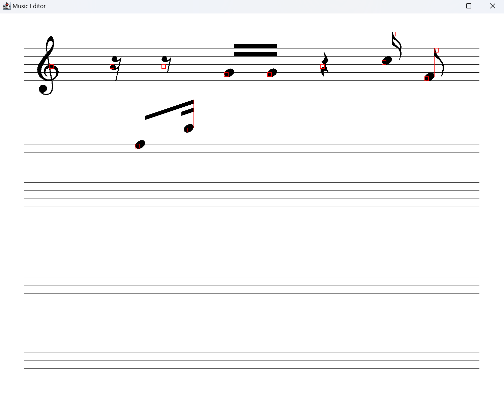

# Gesture-Based-Music-Notation-System

Welcome to the Gesture-based Music Notation System, a user-friendly interface that enables users to input musical notation through gesture recognition.

# Introduction
This innovative system utilizes a simple graphical user interface (GUI) to interpret gestures into musical notation, making the process of composing music intuitive and interactive.

# Features
* Gesture-Based Input: Slide to initiate staff lines for notation. Additional gestures allow for adding and adjusting musical elements.
* Note Creation: Quick swipes are used to add notes with stems, representing different pitches and lengths.
* Interactive Editing: The system allows for immediate editing, such as adding or removing notes and other musical symbols.
* Visual Indicators: Responsive visual feedback is provided for each action to ensure accuracy in music creation.

# Usage
1. Execute `shapeTrainer.java` to train gesture recognition model, including `S-S`, `W-W`, `E-E`, `SW-SW`, `N-N`, `W-S`, and `E-S`.
2. Once you complete training, you can start the music notation editor by executing `App.java`.
